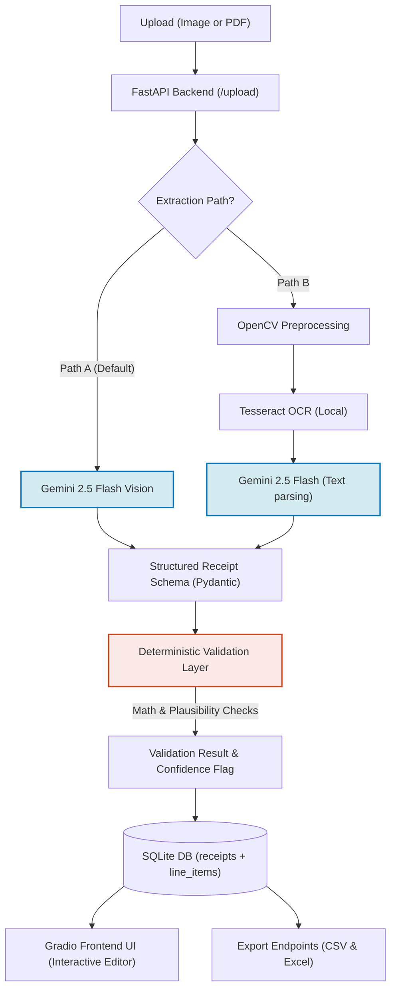

# Invoize: AI-Powered Receipt & Invoice Parser

Invoize is a portfolio-ready document extraction engine that parses unstructured receipts and invoices (images/PDFs) into structured JSON database records. It validates extracted data through an independent, rule-based deterministic layer, stores records in SQLite, and provides export endpoints for CSV and styled Excel workbooks.

Built with a clean separation of concerns, the system features a **FastAPI backend** microservice and an interactive **Gradio frontend UI**.

---

## 🏗️ Architecture Overview

The pipeline supports dual-execution paths for comparing performance and precision:



---

## ✨ Core Features

*   👁️ **Vision-First Extraction (Path A)**: Feeds documents directly to Gemini 2.5 Flash. Uses visual layout context to reliably identify misaligned, crumpled, or folded receipt items.
*   🤖 **Local OCR + LLM Parsing (Path B)**: Runs local **OpenCV** image processing (grayscale conversion, adaptive thresholding, bilateral filtering) -> extracts raw text using **Tesseract OCR** -> structures text using Gemini.
*   📏 **Independent Validation Layer**: A deterministic validation engine checking mathematical integrity (e.g. `quantity × unit_price = total_price`, `subtotal + tax = total`) and flagging future dates or suspicious fields.
*   💾 **Relational SQL Database**: Persists parsed receipts in SQLite using a normalized schema (a `receipts` metadata table and a denormalized `line_items` table).
*   📊 **CSV & Excel Export**: Downloads compiled records into a flat CSV (one row per item) or a styled, multi-sheet Excel workbook.
*   💻 **Obsidian Dark Theme UI**: A flat, premium dark interface built with Gradio for drag-and-drop uploads, interactive schema validation, and live document previewing.

---

## 🧠 Key Engineering Decisions

### 1. Constrained Decoding (Pydantic Schema Enforcement)
Instead of relying on prompt engineering ("Respond in JSON format"), Invoize uses Gemini's native `response_schema` mode. The API client enforces structured generation directly at the LLM decoding stage:
*   **Result**: 0% schema format errors. Malformed JSON, missing fields, or invalid types are physically impossible at the model generation layer.

### 2. Independent Deterministic Validation
LLMs are prone to arithmetic errors and hallucinated confidence. Invoize implements an independent, deterministic Python validation layer:
*   Performs strict floating-point math validations with rounding tolerances.
*   Calculates a weighted completeness score and flags instances requiring manual review.
*   Outputs a trust indicator (`high`, `medium`, `low`) before DB commit.

---

## 📊 Benchmark Results

Both pipelines were benchmarked using a sample receipt with known ground truth to measure precision and processing speed. 

| Pipeline | Success Rate | Average Accuracy | Average Processing Time |
| :--- | :---: | :---: | :---: |
| **Path A: Vision LLM** (Gemini 2.5 Flash) | **1/1 (100.0%)** | **100.0%** | **8.89 seconds** |
| **Path B: OCR + LLM** (Tesseract + Gemini) | 1/1 (100.0%) | 41.7% | 4.56 seconds |

### Key Findings
1.  **Layout Awareness**: Path A (Vision-First) correctly associates price fields with their items based on spatial columns. Path B (OCR+LLM) struggles with column alignments because raw OCR output flattens layout spatial info.
2.  **Noise Robustness**: OCR engines are highly sensitive to shadows and wrinkles, leading to character misreads (e.g., total `13.65` read as `9.47`), while the Vision model successfully extracts correct totals.

---

## 🛠️ Project Structure

```
Invoize/
├── app/
│   ├── __init__.py
│   ├── main.py              # FastAPI app & endpoint routing
│   ├── config.py            # Central configuration & path loading
│   ├── schemas.py           # Pydantic data models (ReceiptData)
│   ├── validation.py        # Independent math validator
│   ├── storage.py           # SQLite CRUD operations
│   ├── export.py            # CSV & Excel exporters
│   ├── benchmark.py         # Benchmarking runner & metrics calculator
│   └── extraction/
│       ├── __init__.py
│       ├── vision_llm.py    # Path A: Gemini Vision
│       ├── ocr.py           # Path B: OpenCV + Tesseract OCR
│       └── pdf_handler.py   # PDF to image helper
├── frontend/
│   └── app.py               # Gradio UI application & styles
├── tests/
│   └── test_set/            # Test images & ground truth JSONs
├── .env.example             # Environment configuration template
├── .gitignore               # Ignored local databases and cache folders
├── requirements.txt         # Project dependencies
└── run.py                   # Unified developer server launcher
```

---

## 🚀 Getting Started

### 1. Prerequisites
*   Python 3.10+
*   (Optional for Path B) **Tesseract OCR** installed locally:
    *   *Windows*: Run `winget install UB-Mannheim.TesseractOCR` in PowerShell (Invoize automatically scans the default directory `C:\Program Files\Tesseract-OCR\tesseract.exe`).

### 2. Installation
Clone the repository and set up a virtual environment:
```bash
# Create and activate virtual environment
python -m venv venv
venv\Scripts\activate

# Install requirements
pip install -r requirements.txt
```

### 3. Configuration
1.  Copy `.env.example` to `.env`.
2.  Acquire a free Gemini API key from [Google AI Studio](https://aistudio.google.com).
3.  Add it to your environment variables file:
    ```env
    GEMINI_API_KEY=your-actual-api-key-here
    ```

### 4. Running the Application
Start both the FastAPI backend and Gradio frontend with the unified launcher script:
```bash
python run.py
```

*   **FastAPI Backend**: Open [http://127.0.0.1:8000/docs](http://127.0.0.1:8000/docs) to access interactive Swagger API documentation.
*   **Gradio UI**: Open [http://127.0.0.1:7860](http://127.0.0.1:7860) to access the interactive web client.

---

## 🧪 Testing and Benchmarking

To run the integration benchmark suite and update performance metrics:
```bash
python -m app.benchmark
```
This runs the dual-pipeline tests on files inside `tests/test_set/` and updates the `docs/benchmark_results.md` report.

---

## 🗺️ Roadmap & Future Enhancements

The next phase of developments for Invoize includes:
*   📥 **Enhanced Exports**: Direct download files for CSV and JSON raw outputs in the frontend.
*   📊 **Batch processing & Excel aggregation**: Uploading multiple bills in a single batch to compile them into a unified multi-sheet Excel summary workbook.
*   🇮🇳 **Indian Rupees (INR) Currency Support**: Localized formatting and validation checks for Rupees `₹` symbols and calculations.
*   📷 **Mobile Camera Capture**: Supporting real-time snapshots to scan and upload bills directly from mobile device web browsers.
*   🏷️ **Discount & Promo validation logic**: Tracking applied discounts and verifying that calculations like `subtotal - discount + tax = total` add up mathematically.
