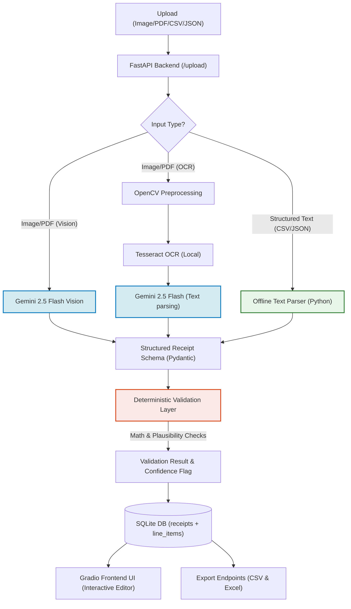

# Invoize: AI-Powered Receipt & Invoice Parser

Invoize is a portfolio-ready document extraction engine that parses unstructured receipts and invoices (images/PDFs) into structured JSON database records. It validates extracted data through an independent, rule-based deterministic layer, stores records in SQLite, and provides export endpoints for CSV and styled Excel workbooks.

Built with a clean separation of concerns, the system features a **FastAPI backend** microservice and an interactive **Gradio frontend UI**.

---

## 🏗️ Architecture Overview

The pipeline supports three execution paths for comparing performance and optimization:



---

## ✨ Core Features

*   👁️ **Vision-First Extraction (Path A)**: Feeds documents directly to Gemini 2.5 Flash. Uses visual layout context to reliably identify items.
*   🤖 **Local OCR + LLM Parsing (Path B)**: Runs local **OpenCV** image processing (grayscale, adaptive thresholding, bilateral filtering) → extracts raw text using **Tesseract OCR** → structures text using Gemini.
*   ⚡ **Hybrid Offline Parser (Path C)**: Automatically detects structured file uploads (`.json`, `.csv`). Parses and maps them directly in Python without making any Gemini API calls. This preserves API quota, runs instantly, and handles offline imports seamlessly.
*   🇮🇳 **Indian Rupees (INR) Support**: Native currency support for mapping Rupees (`₹`, `Rs`, `Rupees`) to INR, with mathematical validation and clean symbol formatting.
*   📷 **Webcam Shutter Capture**: Support for snapping pictures directly inside mobile and desktop web browsers.
*   📏 **Independent Validation Layer**: A deterministic validation engine checking mathematical integrity (e.g. `quantity × unit_price = total_price`, `subtotal - discount + tax + tip = total`) and flagging future dates or suspicious fields.
*   💾 **Relational SQL Database**: Persists parsed receipts in SQLite using a normalized schema (a `receipts` metadata table and a denormalized `line_items` table).
*   📊 **CSV & Excel Export**: Downloads compiled records into a flat CSV (one row per item) or a styled, multi-sheet Excel workbook.
*   📱 **Mobile Responsive Theme**: A beautiful obsidian dark interface built with Gradio that adapts gracefully to mobile viewports.

---

## 🧠 Key Engineering Decisions

### 1. Hybrid Parser Routing (API Quota Protection)
To handle Gemini free-tier rate limits (such as a 20 request daily limit), Invoize routes CSV and JSON uploads through a custom Python parser. It maps fields like store name, dates, discounts, and line items offline. If it's an arbitrary JSON layout, it falls back to the LLM.

### 2. Rate-Limit Resilience (Backoff and Retries)
When processing files in batches, Invoize implements two layers of rate-limit protection:
*   **Frontend Safety Delay**: Introduces a `1.5s` delay between sequential files.
*   **Exponential Backoff**: A backend retry wrapper handles `429 RESOURCE_EXHAUSTED` responses from Gemini by automatically sleeping and retrying.

### 3. Independent Deterministic Validation
LLMs are prone to arithmetic errors. Invoize implements an independent, deterministic validation layer that validates mathematics with float-rounding tolerances, calculates trust indicators (`high`, `medium`, `low`), and flags records requiring human review.

---

## 🛠️ Project Structure

Below is the directory structure. Only clean code and configurations are pushed to the repository; local runtime files are ignored.

```
Invoize/
├── app/
│   ├── __init__.py
│   ├── main.py              # FastAPI app & endpoint routing
│   ├── config.py            # Central configuration & path loading
│   ├── schemas.py           # Pydantic data models & symbol mapping
│   ├── validation.py        # Independent math validator
│   ├── storage.py           # SQLite CRUD operations
│   ├── export.py            # CSV & Excel exporters
│   ├── benchmark.py         # Benchmarking runner & metrics calculator
│   └── extraction/
│       ├── __init__.py
│       ├── vision_llm.py    # Path A: Gemini Vision
│       ├── ocr.py           # Path B: OpenCV + Tesseract OCR
│       ├── pdf_handler.py   # PDF to image helper
│       ├── text_parser.py   # Path C: Direct JSON/CSV offline mapper
│       └── retry_helper.py  # Exponential backoff rate-limit helper
├── frontend/
│   └── app.py               # Gradio UI application & responsive styles
├── tests/
│   └── test_set/            # Test images & ground truth JSONs
│       ├── receipt_1.png
│       └── receipt_1.json
├── .env.example             # Environment configuration template
├── .gitignore               # Excludes secrets (e.g. .env) & DB files
├── requirements.txt         # Project dependencies
└── run.py                   # Unified developer server launcher
```

---

## 🚀 Getting Started

### 1. Prerequisites
*   Python 3.10+
*   (Optional for Path B) **Tesseract OCR** installed locally.

### 2. Installation
Set up a virtual environment and install dependencies:
```bash
# Create and activate virtual environment
python -m venv venv
venv\Scripts\activate      # On Windows
source venv/bin/activate   # On macOS/Linux

# Install requirements
pip install -r requirements.txt
```

### 3. Configuration
1.  Copy `.env.example` to `.env`.
2.  Acquire a free Gemini API key from [Google AI Studio](https://aistudio.google.com).
3.  Add it to your `.env` file:
    ```env
    GEMINI_API_KEY=your_gemini_api_key_here
    ```

### 4. Running the Application
Start both the FastAPI backend and Gradio frontend:
```bash
python run.py
```
*   **FastAPI Backend**: [http://127.0.0.1:8000/docs](http://127.0.0.1:8000/docs) (Swagger API docs)
*   **Gradio UI**: [http://127.0.0.1:7860](http://127.0.0.1:7860) (Interactive Web Client)

---

## 📦 What to Push to GitHub

To ensure a clean, professional repository, only push the source code, configurations, and core test samples. Do **NOT** push local databases, runtime uploads, or credentials.

### Pushed Files (Include in Git)
*   `app/` directory (FastAPI backend, storage, extraction handlers, schema models)
*   `frontend/` directory (Gradio UI app & styles)
*   `tests/` directory (Test suites and sample files)
*   `run.py` (Unified launcher script)
*   `requirements.txt` (Dependencies)
*   `.env.example` (Template for environment variables)
*   `.gitignore` (Repository ignore rules)
*   `README.md` (Project documentation)

### Ignored Files (Do NOT Push)
*   `venv/` (Local virtual environment)
*   `.env` (Contains your private Gemini API key)
*   `receipts.db` (Local SQLite database)
*   `uploads/` (Saved copies of uploaded receipts)
*   `__pycache__/` and compilation folders (`.pyc`)
*   `*.log` files (Temporary runtime logs)
